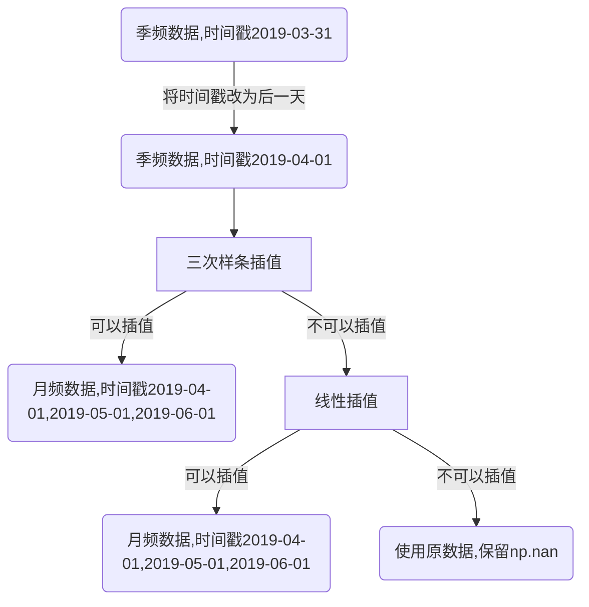
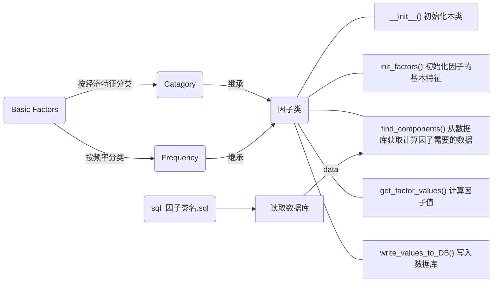

# Tutorial

## Part 1： 数据库概览

### 聚源数据库原有数据表

**证券主表 SecuMain** 重要字段：

| 字段名       | 中文名       | 说明                                                         | 例如     |
| ------------ | ------------ | ------------------------------------------------------------ | -------- |
| InnerCode    | 证券内部编码 | 对于某只A股股票，InnerCode，CompanyCode，SecuCode唯一且一一对应 | '1'      |
| CompanyCode  | 公司代码     | /                                                            | '1'      |
| SecuCode     | 证券代码     | /                                                            | '000001' |
| SecuMarket   | 证券市场     | 通常取83-上海证券交易所；90-深圳证券交易所                   | 83       |
| SecuCategory | 证券类别     | 通常取1-A股                                                  | 1        |
| ListedState  | 上市状态     | 通常取1-上市                                                 | 1        |

**日频数据表**重要字段：

| 字段名     | 中文名       | 说明                   | 例如       |
| ---------- | ------------ | ---------------------- | ---------- |
| InnerCode  | 证券内部编码 | 对应SecuMain.InnerCode | '1'        |
| TradingDay | 交易日       | 日频数据表时间标识     | 2019-04-29 |

**季频数据表**重要字段：

| 字段名      | 中文名               | 说明                               | 例如         |
| ----------- | -------------------- | ---------------------------------- | ------------ |
| CompanyCode | 公司代码证券内部编码 | 对应SecuMain.CompanyCode           | '000001'     |
| EndDate     | 截止日期             | 财务报表报告日；季频数据表时间标识 | '2019-03-31' |

详情见[聚源数据字典](https://dd.gildata.com/)。

### 因子库数据表

**因子主表 factorlist**字段：

| 字段名     | 中文名       | 说明                                       | 例如                                    | Oralce数据类型 |
| ---------- | ------------ | ------------------------------------------ | --------------------------------------- | -------------- |
| FactorCode | 因子代码     | 详情见因子库索引.xlsx                      | '000001'                                | VARCHAR2(16)   |
| 简称       | 因子英文简称 | 同上                                       | 'TotalMV'                               | VARCHAR2(128)  |
| 频率       | 因子频率     | 1代表日频, 2— 周频, 3—月频, 4—季频, 5—年频 | 1                                       | Integer        |
| 类别       | 因子类别     | 说明因子的经济特征和频率特征               | '季频技术类'                            | VARCHAR2(128)  |
| 描述       | 因子描述     | 包含因子的计算方法等说明性内容             | '市销率（PS）＝股票市值/去年营业收入。' | VARCHAR2(512)  |
| 表名       | 因子表名     | 说明这个因子位于数据库的哪个数据表内       | 'DailyValueFactor'                      | VARCHAR2(128)  |

**日频数据表**重要字段：

| 字段名     | 中文名   | 备注                  | 例如         | Oracle数据类型 |
| ---------- | -------- | --------------------- | ------------ | -------------- |
| SecuCode   | 证券代码 | 对应SecuMain.SecuCode | '000001'     | VARCHAR2(20)   |
| TradingDay | 交易日   | 日频数据表时间标识    | '2019-04-29' | DATE           |

**季频**插值到**月频**数据表重要字段：

| 字段名   | 中文名   | 说明                  | 例如         | Oracle数据类型 |
| -------- | -------- | --------------------- | ------------ | -------------- |
| SecuCode | 证券代码 | 对应SecuMain.SecuCode | '000001'     | VARCHAR2(20)   |
| StartDay | 日期     | 每月第一天            | '2019-03-01' | DATE           |

**季频**数据插值到**月频**思路：

代码详见：./factors/BasicFactor.py  seasonal_to_monthly()



**说明**: 将季频数据的时间戳改为财务报告日的后一天,是考虑到财务报告信息对股价的影响应从报告发布后的那一天开始. 

## Part 2： 文件结构

```bash


./factors

|- BasicFactor.py			基础因子类，定义所有因子应该的有的基本特征和基本操作
|- Category.py				因子类别类
|- Frequency.py				因子频率类
	
|- update.py				因子写入/更新主入口
|- update.log				因子入库日志

|- factor_template.py			新类别因子模板,新版
|- factor_template_old.py		新类别因子模板,旧版,已弃用

|- 因子库索引.xlsx			excel版因子库索引
|- 因子库索引_旧1.xlsx		excel版因子库索引, 旧版1
|- 因子库索引_旧2.xlsx		excel版因子库索引, 旧版2
|- 常用sql路径变量.xlsx		sql路径变量
|- README.md				本文件
|- requirements.txt			项目依赖

|- SeasonalComposedBasicFactor		组合基本面因子
	|- form1.py				第一种组合形式
	|- form2.py				第二种组合形式
	|- form3.py				第三种组合形式
	|- 组合基本面因子.xlsx			excel版组合资本面类因子说明
以下是各类因子:		
|- DailyCorrelationFactor.py
|- DailyFinancialModelFactor1.py
|- DailyFinancialModelFactor2.py
|- DailyIdiosyncrasticFactor.py
|- DailyMomentumFactor.py
|- DailyPEG.py
|- DailyTechnicalIndicatorFactor.py
|- DailyTimeSeries.py
|- DailyTurnoverFactor.py
|- DailyValueFactor.py
|- DailyVolatilityFactor.py
|- MonthlyTurnoverFactor.py
|- SeasonalCapitalStructureFactor.py
|- SeasonalCashFactor.py
|- SeasonalDebtFactor.py
|- SeasonalDividendFactor.py
|- SeasonalDuPontFactor.py
|- SeasonalEarningQualityFactor.py
|- SeasonalFinancialQualityFactor.py
|- SeasonalGrowthFactor.py
|- SeasonalOperatingFactor.py
|- SeasonalProfitabilityFactor.py
|- SeasonalSecuIndexFactor.py
|- SeasonalValueFactor.py
|- WeeklyCorrelationFactor.py
|- WeeklyFinancialModelFactor1.py
|- WeeklyFinancialModelFactor2.py
|- WeeklyIdiosyncrasticFactor.py
|- WeeklyMomentumFactor.py
|- WeeklyTechnicalIndicatorFactor.py
|- WeeklyTimeSeries.py
|- WeeklyTurnoverFactor.py
|- WeeklyVolatilityFactor.py
	
|- sql					数据库操作			
	|- pl_sql_oracle.py			数据库读取\写入\修改等
	|- sql_get_last_trading_monthday.sql	获取月最后一个交易日期
	|- sql_get_last_trading_weekday.sql	获取周最后一个交易日期
	|- sql_get_secucode.sql			获取聚源数据库中所有的股票代码
	|- sql_get_tradingday.sql		获取交易日
	|- sql_StockIndex.sql			获取指标
	|- sql_template.sql			sql模板

	以下是从聚源数据库中查询各类因子的sql代码，文件名与因子类名对应：
	|- sql_classical_factor_rawdata.sql
	|- sql_classical_factor_rawdata_weekly.sql
	|- sql_daily_correlation_factor.sql
	|- sql_daily_financialmodel_factor.sql
	|- sql_daily_idiosyncrastic_factor.sql
	|- sql_daily_momentum_factor.sql
	|- sql_daily_peg_1.sql
	|- sql_daily_peg_2.sql
	|- sql_daily_technicalIndicator_factor.sql
	|- sql_daily_timeseries_factor.sql
	|- sql_daily_turnover_factor.sql
	|- sql_daily_value_factor.sql
	|- sql_daily_volatility_factor.sql
	|- sql_monthly_turnover_factor.sql
	|- sql_seasonal_capital_structure_factor.sql
	|- sql_seasonal_cash_factor.sql
	|- sql_seasonal_composed_basic_factor.sql
	|- sql_seasonal_debtpaying_ability_factor.sql
	|- sql_seasonal_dividend_factor .sql
	|- sql_seasonal_dupont_factor.sql
	|- sql_seasonal_earning_quality_factor.sql
	|- sql_seasonal_financial_quality_factor.sql
	|- sql_seasonal_growth_factor.sql
	|- sql_seasonal_operating_factor.sql
	|- sql_seasonal_profitability_factor.sql
	|- sql_seasonal_secu_index_factor.sql
	|- sql_seasonal_value_factor.sql
	|- sql_weekly_correlation_factor.sql
	|- sql_weekly_financialmodel_factor.sql
	|- sql_weekly_idiosyncrastic_factor.sql
	|- sql_weekly_momentum_factor.sql
	|- sql_weekly_technicalindicator_factor.sql
	|- sql_weekly_timeseries_factor.sql
	|- sql_weekly_turnover_factor.sql
	|- sql_weekly_volatility_factor.sql

|- util					工具包
	|- datetime_ops.py			时间戳操作

	|- logger.py				日志处理

	以下是计算各类因子的函数:
	|- StockIndexGroup.py
	|- ClassicalFactorcal.py
	|- ClassicalFactorcal_weekly.py
	|- CorrelationFunc.py
	|- CorrelationFuncProcess.py
	|- FinancialCAPMModelCal.py
	|- FinancialFF3ModelCal.py
	|- FinancialModelFunc.py
	|- FinancialModelFuncProcess.py
	|- IdiosyncrasticFunc.py
	|- IdiosyncrasticFuncProcess.py
	|- MomentumFunc.py
	|- MomentumFuncProcess.py
	|- TechnicalIndicatorFunc.py
	|- TechnicalIndicatorProcess.py
	|- TurnoverFunc.py
	|- TurnoverFuncProcess.py
	|- VolatilityFunc.py
	|- VolatilityFuncProcess.py

```

## Part 3： 设计思路



**说明**:

- Basic Factor类是所有基本因子的父类, 其中定义了每一类因子都应该具备的特征和操作. 其中也包含季频数据转为月频的函数 seasonal_to_monthly(), 月频数据转为日频的函数monthly_to_daily(), 按股票代码一只一只计算因子并写入数据库的函数 write_values_to_DB().

  Catagory 中的类继承自Basic Factor类, 定义因子的经济特征, 如成长类, 估值类等.

  Frequency 中的类继承自Basic Factor类, 定义因子的评率特征, 如日频,月频等.

  一个具体的因子类同时继承Catagory和Frequency, 同时具有Catagory定义的经济特征, 也有Frequency定义的频率特征.

- 调用write_values_to_DB()函数时, 程序先读取股票代码列表, 然后按顺序一只一只处理股票. 对于每一只股票, 首先调用init_factors()初始化因子, 然后调用find_components()从数据库中读取计算因子需要的数据, 并执行插值等预处理操作, 将处理好的数据传给get_factor_values()函数进行计算. 计算出来的数值返回到write_to_DB()函数写入数据库中相应的数据表. 


## Part 4： 命名规范

| 类型                                                         | 英文                    | 命名规范                                                     | 例如                                                         | Oracle数据类型 |
| :----------------------------------------------------------- | ----------------------- | ------------------------------------------------------------ | ------------------------------------------------------------ | -------------- |
| 因子类                                                       | /                       | 频率+经济特征+Factor, 大驼峰命名法                           | DailyValueFactor                                             | /              |
| 因子简称                                                     | name                    | 64个字符以内, 全字母,不能含有符号; 如果是聚源数据库中计算好的因子, 名称与聚源数据库中的名称一致 | TotalMV                                                      | VARCHAR2(64)   |
| 因子代码                                                     | factor_code/ FactorCode | 16个字符以内, 不能以0开头, 字母数字可以混编; 同一类别的因子通常连续编号 | CB0002                                                       | VARCHAR2(16)   |
| 因子频率                                                     | Frequency               | 1代表日频, 2— 周频, 3—月频, 4—季频, 5—年频                   | 1                                                            | Integer()      |
| 因子类别                                                     | type                    | 128个字符以内, 中文, 不含有特殊字符                          | 季频财务质量类                                               | VARCHAR2(128)  |
| 日期标识                                                     | /                       | 日频数据: TRADINGDAY, 月频数据: STARTDAY, 季频数据: ENDDATE  | /                                                            | /              |
| find_components(),  get_factor_values()函数中的列表components | components\[\]\[\]      | 索引0:表名, 同聚源数据库,或者在其后加\_monthly或_daily表示经过插值处理,大小写均可; 索引1: 列名, 同聚源数据库, 必须大写 | components\['LC_MainIndexNew_monthly']['GROSSINCOMERATIO']   | /              |
| 所有sql语句                                                  | SecuMain                | 所有SecuMain都命名为t2                                       | --表1： LC_MainIndexNew select t2.SecuCode,t1.EndDate,t1.SaleServiceCashToORTTM, inner join SecuMain t2 on t1.CompanyCode=t2.CompanyCode where (t2.SecuMarket='83' or t2.SecuMarket='90') | /              |
| sql文件名                                                    | /                       | sql_因子类名.sql, 全小写,下划线命名法                        | sql_daily_value_factor.sql                                   | /              |

## Part 5： 各类操作

### 更新操作入口:  update.py 简介

update.py中的函数分为三种:

- update_factor_list() : 用于更新因子主表

- 其他以update开头的函数: 用于更新因子, 如果需要更新数据的时间段较短, 比如几天或者是几个月,则使用此类函数.

  此类函数对于不需要插值的因子每次加载和写入一段日期内所有股票的数据, 对于需要插值的因每次加载和写入一只股票在一段日期上的数据. 

- 以multidays开头的函数:  用于更新因子, 如果需要更新数据的时间段较长, 比如三四年,则使用此类函数.

  这类函数循环股票代码, 每次加载和写入一只股票在指定时段上的所有数据.

update.py中的所有函数都有两种模式:

- print: 将结果打印在控制台
- write: 将结果写入数据库

**update.py** 写入的相关信息会自动追加到 **update.log** 文件中

### 更新因子主表

在 **./upate.py**中 ,  找到下列语句,修改mode为write后运行, 即可将更新后的因子主表写入数据库. 

```python
update_factor_list(factor_classes=all_classes, mode= 'write')
```

### 因子首次写入数据库

1. 确保在数据库中不存在即将写入的数据表, 如果存在则drop掉

2. 在 **./upate.py**中, 找到需要写入数据库的因子类下方, multidays开头的函数. 

   修改需要写入的因子类别列表, 修改日期范围, 修改mode, 运行即可写入.

   例如: 下方代码代表将DailyTechnicalIndicatorFactor, DailyVolatilityFactor两类因子从2002年12月31日到2018年12月31日的数据写入数据库.

```python
rolling_daily_factors = [DailyTechnicalIndicatorFactor(), DailyVolatilityFactor()]
multidays_write_to_DB(daterange = ['2002-12-31', '2018-12-31'], factor_classes= rolling_daily_factors, mode = 'write')
```

### 更新数据库中已有的因子

1. 确认数据库中已经存在即将写入的数据表, 如果不存在, 写入是会报错"数据表不存在", 但是不影响写入.

2. 在 **update.log** 文件中查找上次更新的记录, 确认聚源已经更新今日的数据, 以此确定此次因子更新的时间范围 

3. 在 **./upate.py**中, 找到需要写入数据库的因子类下方, update开头的函数. 

   修改需要写入的因子类别列表, 修改日期范围, 修改mode, 运行即可写入.

   例如: 下方代码代表将DailyTechnicalIndicatorFactor, DailyVolatilityFactor两类因子从2019年05月01日到今日的数据写入数据库.

   ```python
   rolling_daily_factors = [DailyTechnicalIndicatorFactor(),DailyVolatilityFactor()]
   update_rolling_factors(daterange = ['2019-05-01', datetime.date.today()], factor_classes= rolling_daily_factors, mode = 'write')
   ```

### 更新因子值

### 添加新类别

1. sql操作

   找出计算新类别因子需要从聚源数据库中取出的表名和字段名

   复制 **./sql/sql_template.py**, 按照新类别的名字更名

   按照sql_template中的提示, 对于每一个需要从数据库中取出的数据表写一个sql查询语句, 注意必须以where语句结尾.

2. 因子类操作

   在 **category.py** 文件中加入相应的类别

   复制 **./factor_template.py**, 按照新类别的名字更名

   按照 **./factor_template.py **文件中的注释修改相应的内容, 需要修改的地方已经在代码中逐个注释, 并且已经以 **! **开头标识了出来

3. 在 **./upate.py **文件中:

   将新的因子类的实例添加到 all_classes 列表中

   确定因子的更新方式, 将新因子类的实例添加到相应的更新列表中, 比如:

   ```python
   ordinary_daily_classes = [DailyValueFactor(), NewClassName()]
   ```

   如果新因子类无法适用于现有的所有更新方法, 则重新写更新方法.

### 在已有的类别中添加新的因子

1. 在路径 **./sql/sql_因子类名.sql** 下找出对应的sql文件并按照其中的提示修改, 注意sql查询语句必须以where结尾

2. **./因子类名.py** 文件中:

   a. 找到 **init_factors()** 函数, 在已经写好的因子后面追加:

   ```python
   # !因子简称 !因子中文名
    !因子简称 = !因子类名(factor_code='!因子代码',
                         name='!因子英文简称',
                         describe='!中文描述, 如何计算因子等内容')
   factor_entities['!因子简称'] = !因子简称
   ```

   b. 找到 **find_components()** 函数

   - ​	如果新因子与本类已有的因子使用的是**相同的聚源数据表**, 并且需要插值处理, 则**修改**以下语句中带感叹号的地方:

   ```python
   components['已有的聚源表名_monthly']  = self.seasonal_to_monthly(components['已有的聚源表名'],['已有的字段1','已有的字段2(全大写)', '!新因子的字段(全大写)'])
   ```

   - ​	如果新因子用到了与本类已经有的因子**不同的聚源数据表**, 则在函数中**追加**:

   ```python
   components['!表1名, 同聚源数据库']  = components['!表1名, 同聚源数据库'].sort_values(by='!表1时间标识符(全大写)')
   
   # 如果需要插值转换
   components['!表1名_monthly']  = self.seasonal_to_monthly(components['!表1名, 同聚源数据库'],['!需要转换的字段1(全大写)','!需要转换的字段2(全大写)'])
   ```

   c.  找到 **get_factor_values()** 函数

   在已经写好的因子后面追加:

   ```python
   factor_values['!新因子简称'] = components['!表名']['!字段名(全大写)'] +/或者其他操作 components['!表名']['!字段名(全大写)']
   ```

## Part 6： 异常处理与其他注意事项

### 异常处理

| 错误内容                                      | 实际报错位置                                         | 报错原因                                            | 解决方法                                           |
| --------------------------------------------- | ---------------------------------------------------- | --------------------------------------------------- | -------------------------------------------------- |
| TRADINGDAY/ ENDDATE 部分股票报错              | sql查询语句                                          | 聚源数据库的指定数据表没有当前这只的股票的数据      | 忽略                                               |
| TRADINGDAY/ ENDDATE 所有股票报错              | find_components()                                    | 时间标识写错                                        | 查看时间标识符是否和频率匹配，是否全部大写         |
| x and y array must have at least 2 entries    | 线性插值                                             | 数据点过少，连线性插值都不能使用                    | 使用原数据                                         |
| derivatives not match cubic spline            | 三次样条插值                                         | 数据点过少，不能应用三次样条插值                    | 改用其他插值方法                                   |
| FutureWarning: convert_objects is deprecated. | InputDataPreprocess(),将非float格式的数据转换为float | convert_objects()函数在更新的pandas版本中将不再支持 | 因为没有找到新版本pandas中的替代方法, 此处忽略即可 |
| factor error                                  | 具体分析                                             | 具体分析                                            | 具体分析                                           |
| ORA-00942: 表或视图不存在                     | ./update.py 中的 update开头的函数                    | 数据库中没有这张表, 却执行了delete操作              | 忽略                                               |

### 注意事项

#### sql文件

- 周频数据查询时, 因为时间列表是截止到2049年而非当前日期, 所以需要限制时间到 <=today
- **factor_template** 中的 find_components() 的 table_name 列表的长度与sql语句的条数要一致
- 


#### 数据预处理

- 季度数据使用插值法之后，临近现在时间的一个季度没有数据，暂时用上一个季度的报告值代替


#### 数据库读写

- 同时读写、频繁读写数据库会导致数据表锁死（阀值未知）


- Oracle有session数上限，多个程序访问可能导致超时
- 写入数据的大小超过Oracle数据上下限时, 会导致写入失败, 可以用log1p函数将其限定在一个范围内
- 读取数据库时,一次读入不要超过5年的日频数据,否则会因为数据库端口不够而断连
- 从pl/sql中读取表中的字段名必须大写，将因子写入数据库时，字段名可以小写也可以大写。若字段名存在小写字符，则在查询语句中应该双引号。
- 同一条sql语句得到的数据的交易日期肯定是对齐的，注意不同的sql语句得到的数据可能需要日期或者股票代码对齐。

#### pandas使用

- 在pandas中,所有的缺失数据, 无论是None还是np.nan都会显示为Nah
- 如果要判断pandas中某个位置的数据是不是缺失, 使用 pd.isnull(DataFrame) 函数
- 直接两个只含有一列数据的DataFrame直接相乘会出错；选择列名后再相乘。

#### 其他

- 需要除法运算的时候, 分母要加上极小数, 比如1e-6
- 目前在对指数的回归中，只采用了IC,IF以及IH指数，这三类数据的起始日期从2005年开始。
- 
- 在进行回归的时候，自变量比如指数数据，因变量比如涨跌幅数据注意进行日期匹配。
- 有些类别因子的方法的输出并不一定是一个含有因子的dataframe，可能是dict()，存储不同时间窗口滚动下的因子数据。
- 因子类中的方法名必须是合理的变量名，在生成由该类方法得到的因子时的命名会用到方法名。
- **factor_template** 中的get_factor_values()中的factor_values的['TradingDay']以及['SecuCode']的长度、日期要与后面生成得到的因子数据对齐。
- **dailytimeseries** 以及 **weeklytimeseries** 两个表格用来存储一些常用的时间序列数据，比如SMB,HML等，进行回归时需要用到。在更新与这个两个表相关的因子之前，必须先更新这两个时间序列表格。

