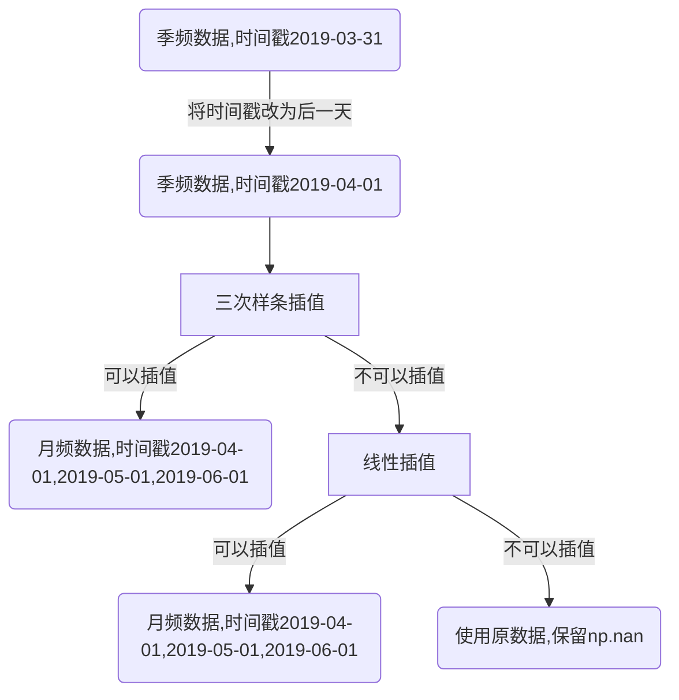
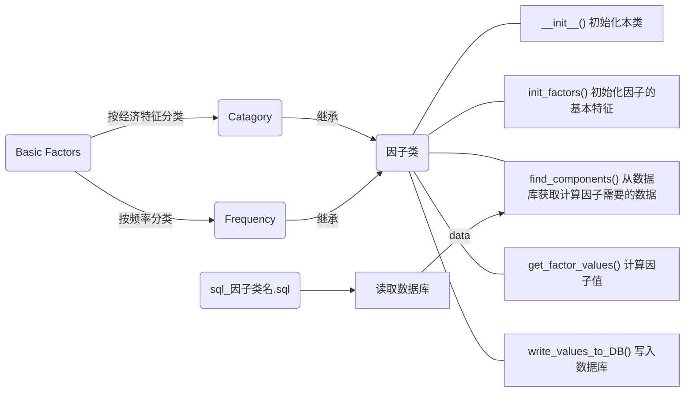

# Tutorial

- [ ] TODO: 代码改好之后，更新组合基本面因子相关说明

## Part 1： 数据库概览

### 聚源数据库原有数据表

**证券主表 SecuMain** 重要字段：

| 字段名       | 中文名       | 说明                                                         | 例如     |
| ------------ | ------------ | ------------------------------------------------------------ | -------- |
| InnerCode    | 证券内部编码 | 对于某只A股股票，InnerCode，CompanyCode，SecuCode唯一且一一对应 | '1'      |
| CompanyCode  | 公司代码     | /                                                            | '1'      |
| SecuCode     | 证券代码     | /                                                            | '000001' |
| SecuMarket   | 证券市场     | 通常取83-上海证券交易所；90-深圳证券交易所                   | 83       |
| SecuCategory | 证券类别     | 通常取1-A股                                                  | 1        |

**日频数据表**重要字段：

| 字段名     | 中文名       | 说明                   | 例如       |
| ---------- | ------------ | ---------------------- | ---------- |
| InnerCode  | 证券内部编码 | 对应SecuMain.InnerCode | '1'        |
| TradingDay | 交易日       | 日频数据表时间标识     | 2019-04-29 |

**季频数据表**重要字段：

| 字段名      | 中文名               | 说明                               | 例如         |
| ----------- | -------------------- | ---------------------------------- | ------------ |
| CompanyCode | 公司代码证券内部编码 | 对应SecuMain.CompanyCode           | '000001'     |
| EndDate     | 截止日期             | 财务报表报告日；季频数据表时间标识 | '2019-03-31' |

详情见[聚源数据字典](https://dd.gildata.com/)。

### 因子库数据表

**因子主表 factorlist**重要字段：

| 字段名     | 中文名       | 说明                                       | 例如                                    | 数据类型      |
| ---------- | ------------ | ------------------------------------------ | --------------------------------------- | ------------- |
| FactorCode | 因子代码     | 详情见因子库索引.xlsx                      | '000001'                                | VARCHAR2(16)  |
| 简称       | 因子英文简称 | 同上                                       | 'TotalMV'                               | VARCHAR2(64)  |
| 频率       | 因子频率     | 1代表日频, 2— 周频, 3—月频, 4—季频, 5—年频 | 1                                       | Integer       |
| 类别       | 因子类别     | 说明因子的经济特征和频率特征               | '季频技术类'                            | VARCHAR2(128) |
| 描述       | 因子描述     | 包含因子的计算方法等说明性内容             | '市销率（PS）＝股票市值/去年营业收入。' | VARCHAR2(512) |

**日频数据表**重要字段：

| 字段名     | 中文名   | 备注                  | 例如         | 数据类型     |
| ---------- | -------- | --------------------- | ------------ | ------------ |
| SecuCode   | 证券代码 | 对应SecuMain.SecuCode | '000001'     | VARCHAR2(20) |
| TradingDay | 交易日   | 日频数据表时间标识    | '2019-04-29' | DATE         |

**季频**插值到**月频**数据表重要字段：

| 字段名    | 中文名   | 说明                  | 例如         | 数据类型     |
| --------- | -------- | --------------------- | ------------ | ------------ |
| SecuCode  | 证券代码 | 对应SecuMain.SecuCode | '000001'     | VARCHAR2(20) |
| StartDate | 日期     | 每月第一天            | '2019-03-01' | DATE         |

**季频**数据插值到**月频**思路：

代码详见：./factors/BasicFactor.py  seasonal_to_monthly()



**说明**: 将季频数据的时间戳改为财务报告日的后一天,是考虑到财务报告信息对股价的影响应从报告发布后的那一天开始. 

## Part 2： 文件结构

```bash
./factors
|- BasicFactor.py 				基础因子类，定义所有因子应该的有的基本特征和基本操作
|- Category.py 						因子类别类
|- Frequency.py 					因子频率类
|- factor_template.py 		新类别因子模板
|- update.py 							因子写入/更新主入口, 批量操作因子
|- 因子库索引.xlsx		
|- README.md

|- DailyTechnicalIndicatorFactor.py		日频技术指标类因子
|- DailyValueFactor.py								日频价值类因子
|- SeasonalCapitalStructureFactor.py	季频资本结构类因子
|- SeasonalCashFactor.py							季频现金状况类因子
|- SeasonalDebtpayingAbilityFactor.py	季频偿债能力因子
|- SeasonalDividendFactor.py					季频分红能力类因子
|- SeasonalDuPontFactor.py						季频杜邦分析体系因子
|- SeasonalEarningQualityFactor.py		季频收益质量类因子
|- SeasonalFinancialQualityFactor.py	季频财务质量类因子
|- SeasonalGrowthFactor.py						季频成长类因子
|- SeasonalOperatingFactor.py					季频营运能力类因子
|- SeasonalProfitabilityFactor.py			季频盈利能力因子
|- SeasonalSecuIndexFactor.py					季频每股指标因子
|- SeasonalValueFactor.py							季频价值类因子

|- util						工具包
	|- datetime_ops.py								时间戳操作
	|- TechnicalIndicatorFunc.py			技术指标类因子计算
	|- TechnicalIndicatorProcess.py		技术指标类因子计算

|- sql 				数据库操作
	|- dbsynchelper2.py				数据库读取
	|- GetSQLsentence.py			数据库读取
	|- pl_sql_oracle.py				数据库读取
	|- sql_template.sql				sql查询模板
	|- sql_get_secucode.sql		获取聚源数据库中所有的股票代码
	
	以下是从聚源数据库中查询各类因子的sql代码，文件名与因子类名对应：
	|- sql_daily_technicalIndicator_factor.sql
	|- sql_daily_value_factor.sql
	|- sql_seasonal_capital_structure_factor.sql
	|- sql_seasonal_cash_factor.sql
	|- sql_seasonal_debtpaying_ability_factor.sql
	|- sql_seasonal_dividend_factor .sql
	|- sql_seasonal_dupont_factor.sql
	|- sql_seasonal_earning_quality_factor.sql
	|- sql_seasonal_financial_quality_factor.sql
	|- sql_seasonal_growth_factor.sql
	|- sql_seasonal_operating_factor.sql
	|- sql_seasonal_profitability_factor.sql
	|- sql_seasonal_secu_index_factor.sql
	|- sql_seasonal_value_factor.sql

```

## Part 3： 设计思路



**说明**:

- Basic Factor类是所有基本因子的父类, 其中定义了每一类因子都应该具备的特征和操作. 其中也包含季频数据转为月频, 月频数据转为日频的函数. 

  Catagory 中的类继承自Basic Factor类, 定义因子的经济特征, 如成长类, 估值类等.

  Frequency 中的类继承自Basic Factor类, 定义因子的评率特征, 如日频,月频等.

  一个具体的因子类同时继承Catagory和Frequency, 同时具有Catagory定义的经济特征, 也有Frequency定义的频率特征.

- 调用write_values_to_DB()函数时, 程序先读取股票代码列表, 然后按顺序一只一只处理股票. 对于每一只股票, 首先调用init_factors()初始化因子, 然后调用find_components()从数据库中读取计算因子需要的数据, 并执行插值等预处理操作, 将处理好的数据传给get_factor_values()函数进行计算. 计算出来的数值返回到write_to_DB()函数写入数据库中相应的数据表. 

- 因子计算的过程是对股票代码进行循环, 也就是说每次计算中, 读取和处理的是某一只股票在所有时间上的数据. 

  循环股票代码的代码在函数 write_values_to_DB() 中. 如果需要修改数据所处的时间范围 , 请修改 **./sql/sql_因子类名.sql** 文件. 如果需要修改需要从数据库取出的股票代码范围,  请修改 **./sql/sql_get_secucode.sql**.

## Part 4： 命名规范

| 类型                                                         | 英文               | 命名规范                                                     | 例如                                                         | 数据类型      |
| :----------------------------------------------------------- | ------------------ | ------------------------------------------------------------ | ------------------------------------------------------------ | ------------- |
| 因子类                                                       | /                  | 频率+经济特征+Factor, 大驼峰命名法                           | DailyValueFactor                                             | /             |
| 因子简称                                                     | name               | 64个字符以内, 全字母,不能含有符号; 如果是聚源数据库中计算好的因子, 名称与聚源数据库中的名称一致 | TotalMV                                                      | VARCHAR2(64)  |
| 因子代码                                                     | factor_code        | 16个字符以内, 不能以0开头, 字母数字可以混编; 同一类别的因子通常连续编号 | CB0002                                                       | VARCHAR2(16)  |
| 因子频率                                                     | Frequency          | 1代表日频, 2— 周频, 3—月频, 4—季频, 5—年频                   | 1                                                            | Integer()     |
| 因子类别                                                     | type               | 128个字符以内, 中文, 不含有特殊字符                          | 季频财务质量类                                               | VARCHAR2(128) |
| 日期标识                                                     | /                  | 日频数据: TRADINGDAY, 月频数据: STARTDAY, 季频数据: ENDDATE  | /                                                            | /             |
| find_components(),  get_factor_values()函数中的列表components | components\[\]\[\] | 索引0:表名, 同聚源数据库,或者在其后加\_monthly或_daily表示经过插值处理,大小写均可; 索引1: 列名, 同聚源数据库, 必须大写 | components['LC_MainIndexNew_monthly']['GROSSINCOMERATIO']    | /             |
| 所有sql语句                                                  | SecuMain           | 所有SecuMain都命名为t2                                       | --表1： LC_MainIndexNew select t2.SecuCode,t1.EndDate,t1.SaleServiceCashToORTTM, inner join SecuMain t2 on t1.CompanyCode=t2.CompanyCode where (t2.SecuMarket='83' or t2.SecuMarket='90') and (t1.enddate >= to_date( '2004-12-31 00:00:00','yyyy-mm-dd hh24:mi:ss') ) | /             |
| sql文件名                                                    | /                  | sql_因子类名.sql, 全小写,下划线命名法                        | sql_daily_value_factor.sql                                   | /             |

## Part 5： 使用步骤 

### 添加新类别

1. sql操作

   a. 找出计算新类别因子需要从聚源数据库中取出的表名和字段名

   b. 复制 **./sql/sql_template.py**, 按照新类别的名字更名

   c. 按照sql_template中的提示, 对于每一个需要从数据库中取出的数据表写一个sql查询语句, 注意必须以where语句结尾.

2. 因子类操作

   a. 在 **category.py** 文件中加入相应的类别

   b. 复制 **./factor_template.py**, 按照新类别的名字更名

   c. 按照 **./factor_template.py **文件中的注释修改相应的内容, 需要修改的地方已经在代码中逐个注释, 并且已经以 **! **开头标识了出来

3. 在 **./upate.py **文件中追加:

```python
!因子类名的initials = !因子类名()
data_sql_file_path = !r'D:\Meiying\codes\industrial\factors\sql\.sql' # 读取数据库数据的sql代码文件路径
code_sql_file_path = !r'D:\Meiying\codes\industrial\factors\sql\sql_get_secucode.sql'  # 查询股票代码的sql文件路径
!因子类名的initials.write_values_to_DB(data_sql_file_path=data_sql_file_path, code_sql_file_path = code_sql_file_path)
curr_list = !因子类名的initials.get_factor_list()
factor_list = factor_list.append(curr_list, ignore_index=True)
```

### 在已有的类别中添加新的因子

1. 在路径 **./sql/sql_因子类名.sql** 下找出对应的sql文件并按照其中的提示修改, 注意sql查询语句必须以where结尾

2. **./因子类名.py** 文件中:

   a. 找到 **init_factors()** 函数, 在已经写好的因子后面追加:

   ```python
   # !因子简称 !因子中文名
    !因子简称 = !因子类名(factor_code='!因子代码',
                         name='!因子英文简称',
                         describe='!中文描述, 如何计算因子等内容')
   factor_entities['!因子简称'] = !因子简称
   ```

   b. 找到 **find_components()** 函数

   - ​	如果新因子与本类已有的因子使用的是**相同的聚源数据表**, 并且需要插值处理, 则**修改**以下语句中带感叹号的地方:

   ```python
   components['已有的聚源表名_monthly']  = self.seasonal_to_monthly(components['已有的聚源表名'],['已有的字段1','已有的字段2', '!新因子的字段'])
   ```

   - ​	如果新因子用到了与本类已经有的因子**不同的聚源数据表**, 则在函数中**追加**:

   ```python
   components['!表1名, 同聚源数据库']  = components['!表1名, 同聚源数据库'].sort_values(by='!表1时间标识符')
   
   # 如果需要插值转换
   components['!表1名_monthly']  = self.seasonal_to_monthly(components['!表1名, 同聚源数据库'],['!需要转换的字段1','!需要转换的字段2'])
   ```

   c.  找到 **get_factor_values()** 函数

   在已经写好的因子后面追加:

   ```python
   factor_values['!新因子简称'] = components['!表名']['!字段名'] + components['!表名']['!字段名']
   ```

### 更新因子主表

找到 **./upate.py** , 注释掉所有含有write_to_DB()函数的语句, 运行update.py中下面这段代码, 即可将更新后的因子主表写入数据库:

```python
from sqlalchemy import String, Integer
pl_sql_oracle.df_to_DB(df=factor_list, table_name='factorlist',if_exists= 'replace',
                           data_type={'FactorCode': String(16), '简称': String(64), '频率': Integer(),'类别': String(128), '描述': String(512)})
```

### 更新因子值

找到 **./upate.py** , 运行需要更新的因子类的write_to_DB()函数

## Part 6： 异常处理与其他注意事项

### 异常处理

| 错误内容            | 实际报错位置 | 报错原因                                       | 解决方法 |
| ------------------- | ------------ | ---------------------------------------------- | -------- |
| TRADINGDAY/ ENDDATE | sql查询语句  | 聚源数据库的制定数据表没有当前这只的股票的数据 | 忽略     |
|                     |              |                                                |          |
|                     |              |                                                |          |

### 其他注意事项

#### sql文件

- 写sql语句时, 如果要取2005-01-01及之后的数据，要设置date >= 2004-12-31, 否则第一季度数据无法插值


#### 数据预处理

- 季度数据使用插值法之后，临近现在时间的一个季度没有数据，暂时用上一个季度的报告值代替


#### 数据库写入

- 同时读写、频繁读写数据库会导致数据表锁死（阀值未知）


- 数据库有session数上限，多个程序访问可能导致超时


- 写入时，数据超过数据字段字符数上限不会报错

  